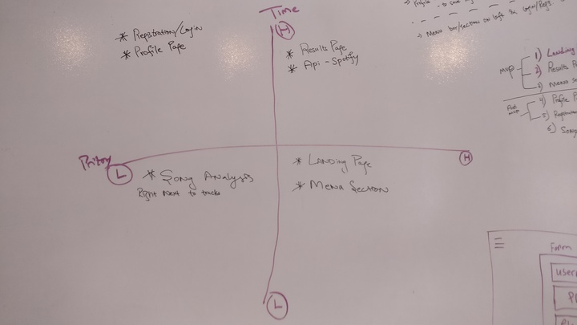
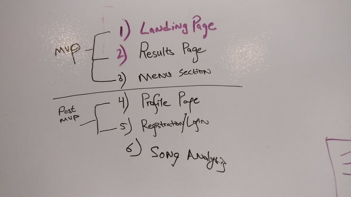
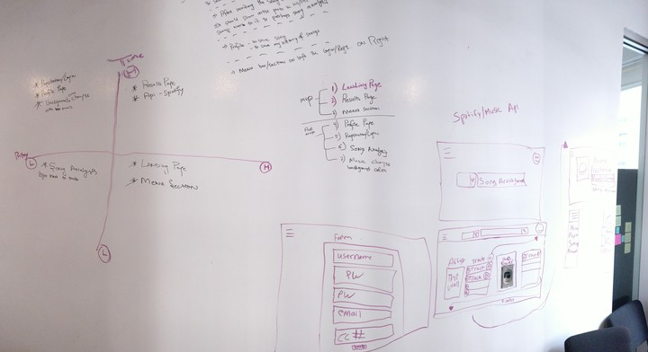
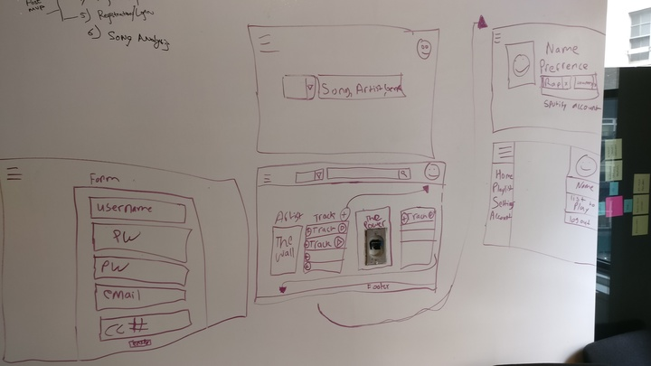
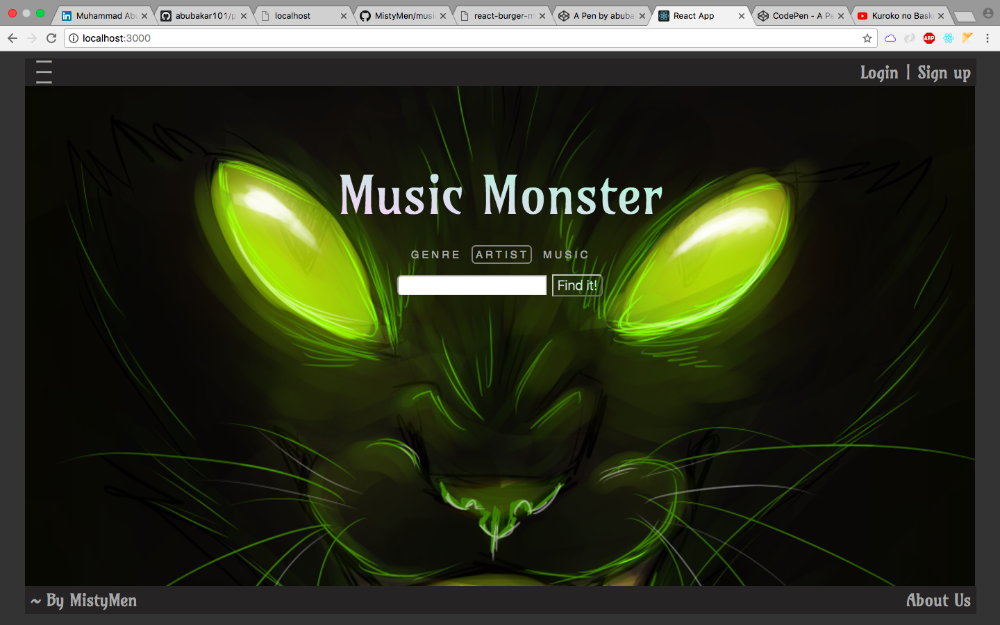
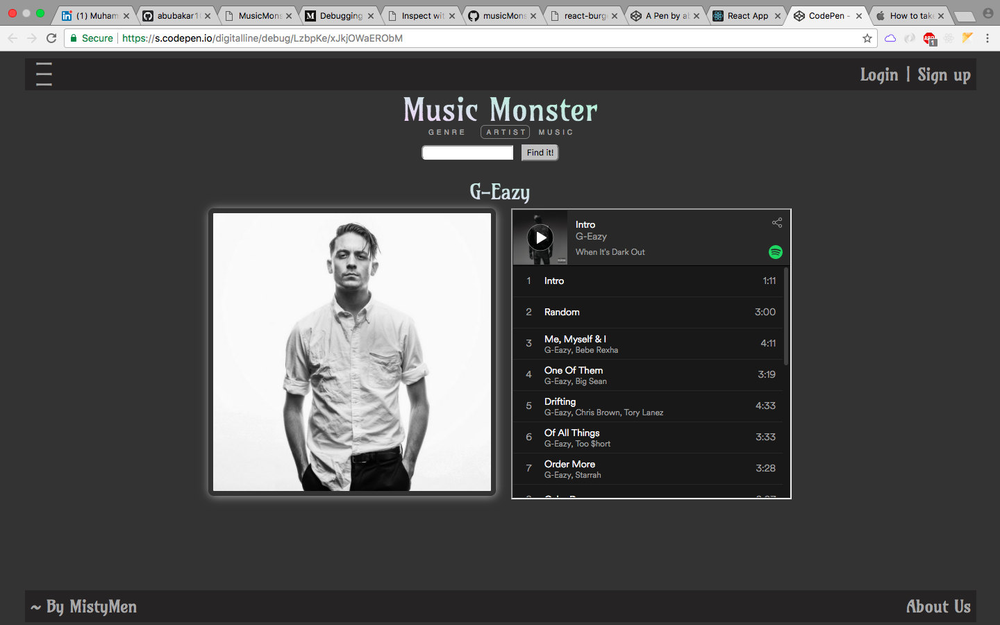
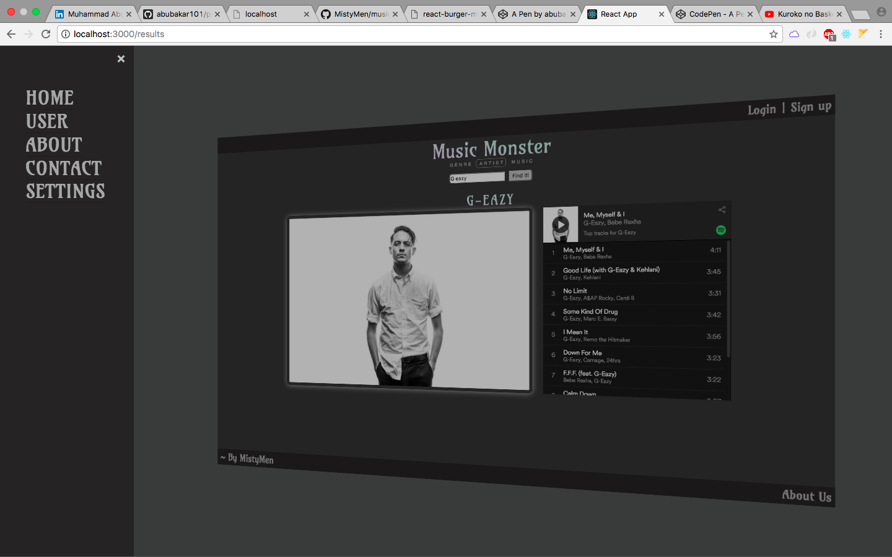
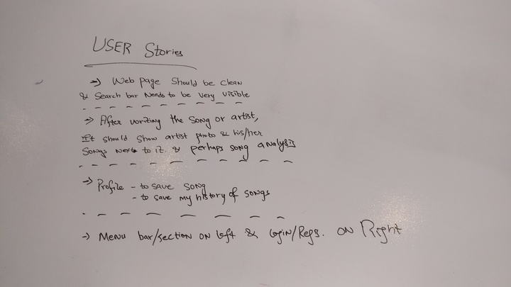

# Project Overview

## Project Description

Our application is a playlist manager, that lets you save and manage your favorite artists albums. Our user-friendly music monster currently lets you search for artists using the spotify api and saving their albums to our database. You can play a clip on your browser from our website, or if you have the application you can control spotify right from your browser!


## Installation
- Fork it to your github account!
- Clone it to your local machine!
- Go to migration folder in "musicMonster/monster/db/migration/" and then type `psql`
- Create database by typing in psql `CREATE DATABASE monster_dev;`
- Then come out from "psql" by typing `\q`
- Create table by typing `psql -f migration.sql` inside the "./migration" folder
- In "monster" directory "./musicMonster/monster/", type `npm install` - to install all the dependences for node.js!
- Then do same in "/client" directory for REACT.
- You are ready to GO! Of course you also need Spotify token and then put it inside the "./musicMonster/monster/client/src/MusicMonster.js" file and inside the file, the variable called "APIToken" in "callSpotifyApi" function on line '117' - replace with the old one....
- Inside the "musicMonster/monster/" type `npm start` to start the server on http://localhost:3001/ 
- Inside the "musicMonster/monster/client" type `npm start` to start the server on http://localhost:3000/  


## Priority Matrix


 
## MVP & Post-MVP


## Wireframes






## User Stories


## Project Management
### Completed Tasks
- Creating Node.js server
- Creating React server
- Conntecting both front and backend server
- Getting API from Spotify
- Working On CSS
- CAN Read API data based on user search
- CAN ADD to DATABASE
- CAN READ from DATABASE and show to user

### Uncompleted Tasks
- CAN Delete saved songs and edit comments
- CAN Login and Sign up
- User can save and only show after user has logged in - No global saving!


## Functional Components

| Feature | Priority | Estimated Time | Time Invetsted | Actual Time |
| --- | :---: |  :---: | :---: | :---: |
| Results Page | H | 3-4hrs | 6hrs | 12hrs |
| API | H | 6hrs | 3 Days | 3-4 Days |
| Main Menu | H | 2hrs | 4hrs | 5hrs |
| Registration/Login | L | 3 Days | 4 Days | +++ |

## Code Snippet

```
render() {
    console.log("Rendering...");
    console.log(this.state.home);

    let searchF = null;
    if (
      window.location.href.includes("login") == false &&
      window.location.href.includes("register") == false
    ) {
      searchF = (
        <div className="searchSection">
          <h3>
            <span>Genre</span>
            <span className={"artist" + (this.state.home ? "" : "Sec")}>
              Artist
            </span>
            <span>Music</span>
          </h3>
          <SearchForm
            home={this.state.home}
            handleInputChange={this.handleInputChange}
            callSpotifyApi={this.callSpotifyApi}
            input={this.state.input}
          />
        </div>
      );
    }
    return (
      <div id="outer-container">
        <Menu />
        <main id="page-wrap">
          <Nav />

          <div className={"container" + (this.state.home ? "" : "Sec")}>
            <div className={this.state.home ? "front" : "results"}>
              <div className={"title" + (this.state.home ? "" : "Sec")}>
                Music Monster
              </div>
              <div className={"search" + (this.state.home ? "" : "Sec")}>
                {searchF}
                <Switch>
                  <Route
                    exact
                    path="/login"
                    render={props => (
                      <Login
                        username={this.state.username}
                        password={this.state.password}
                        handleUsernameInput={this.handleUsernameInput}
                        handlePasswordInput={this.handlePasswordInput}
                      />
                    )}
                  />
                  <Route
                    exact
                    path="/register"
                    render={props => (
                      <Register
                        username={this.state.username}
                        password={this.state.password}
                        handleUsernameInput={this.handleUsernameInput}
                        handlePasswordInput={this.handlePasswordInput}
                      />
                    )}
                  />
                  <Route
                    exact
                    path="/results"
                    render={props => (
                      <Results
                        submit={this.submitToServer}
                        checkUrl={this.checkUrl}
                        artist={this.state.artist}
                        image={this.state.image}
                        song={this.state.song}
                        data={this.state.searchData}
                        input={this.state.input}
                        submitToServer={this.submitToServer}
                      />
                    )}
                  />
                  <Route
                    exact
                    path="/user"
                    render={props => (
                      <User
                        checkUrl={this.checkUrl}
                        callingDB={this.callingDB}
                        dataBase={this.state.dataBase}
                        handleSongDelete={this.handleSongDelete}
                      />
                    )}
                  />
                </Switch>
              </div>
            </div>
          </div>
          <Footer />
        </main>
      </div>
    );
  }


```


It is inside the musicController.js which is the main file in REACT that connects all the components and backend Node.js server. This `return` renders the "CSS" and all the funtionalities such as calling API, getting data from database, taking input's values from user and saving temporarily into states, submitting saved artist's song by user into database. And of course other 'CRUD' methods such as editing and deleting.     

## Additional Libraries
 Burger King Menu - https://github.com/negomi/react-burger-menu
  Burger King Menu Example - http://negomi.github.io/react-burger-menu/

