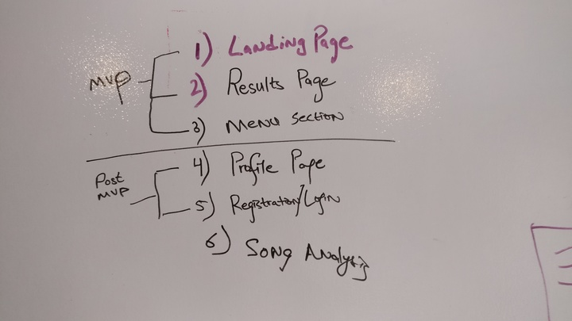
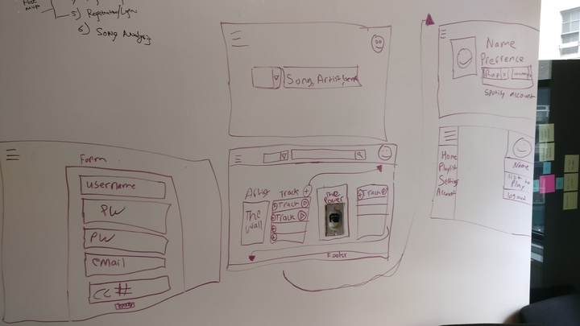
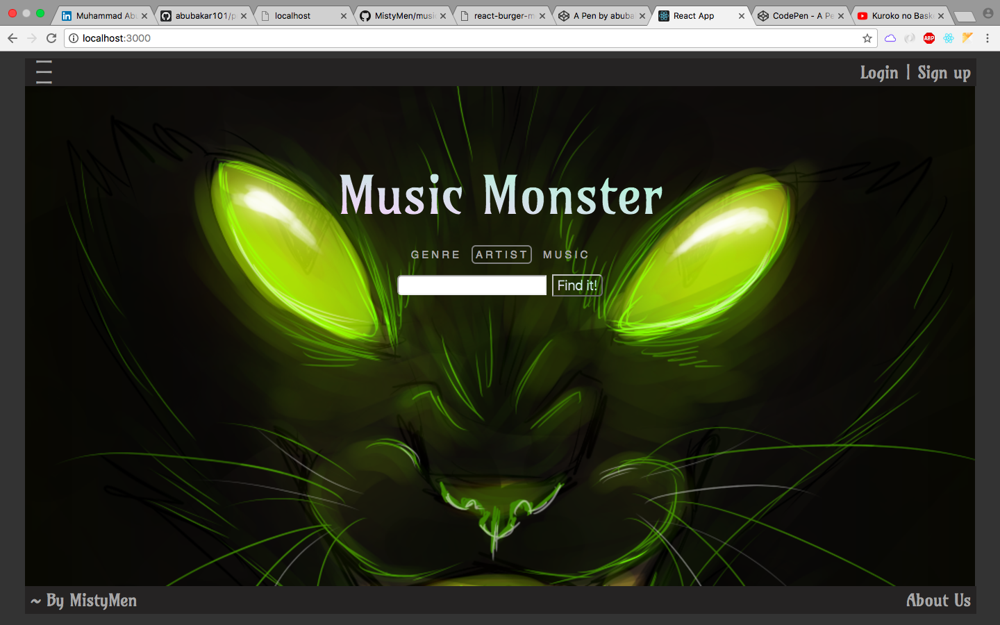

# Project Overview

## Project Description

Our application is a playlist manager, that lets you save and manage your favorite artists albums. Our user-friendly music monster currently lets you search for artists using the spotify api and saving their albums to our database. You can play a clip on your browser from our website, or if you have the application you can control spotify right from your browser!

## Installation
- Fork it to your account!
- Clone it to your local machine!
- Go to migration folder in "musicMonster/monster/db/migration/" and then type `psql`
- Create database by typing in psql `CREATE DATABASE monster_dev;`
- Then come put from "psql" by typing `\q`
- Create table by typing `psql -f migration.sql` inside the "./migration" folder
- In "monster" directory "./musicMonster/monster/", type `npm install` - to install the node.js server
- Then do same in "/client" directory - to install the react server
- You are ready to GO! Of course you also need Spotify token and then put it inside the "./musicMonster/monster/client/src/MusicMonster.js" file and inside the file, the variable called "APIToken" in "callSpotifyApi" function on line '117` - replace with the old one....

## Priority Matrix

 
## MVP & Post-MVP

## Wireframes

## User Stories

## Project Management
### Completed Tasks
- Creating Node.js server
- Creating React server
- Conntecting both front and backend server
- Getting API from Spotify
- Working On CSS
- CAN Read API data based on user search
- CAN ADD to DATABASE
- CAN READ from DATABASE and show to user

### Uncompleted Tasks
- CAN Delete and edit
- CAN Login and Sign up

## Routes..Controllers..Models..Views..Oh My...

Use this section to document the routes and supporting functionality of the app. 

| Route | Controller | Model | Does | Result | View | Exits |
| --- | :---: |  :---: | :---: | :---: | :---: | :---: |
| /quotes | GET | Index | findAll | Selects *  | [{quotes}] | ShowQuotes | redirect(/quotes) 

## Functional Components

Time frames are also key in the development cycle.  You have limited time to code all phases of the game.  Based on the prioritized feature list completed in the `Priority Matix` and assign time estimates.  

| Feature | Priority | Estimated Time | Time Invetsted | Actual Time |
| --- | :---: |  :---: | :---: | :---: |
| add a todo | H | 1hrs |  |  |

## Code Snippet

Use this section to include a brief code snippet of functionality that you are proud of an a brief description.  

## Additional Libraries
 Use this section to list all supporting libraries and thier role in the project. 

## Change Log
 Use this section to document what changes were made and the reasoning behind those changes.  

## Issues and Resolutions
 Use this section to list of all major issues encountered and their resolution.

#### SAMPLE.....
**ERROR**: app.js:34 Uncaught SyntaxError: Unexpected identifier                                
**RESOLUTION**: Missing comma after first object in sources {} object
